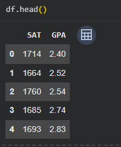
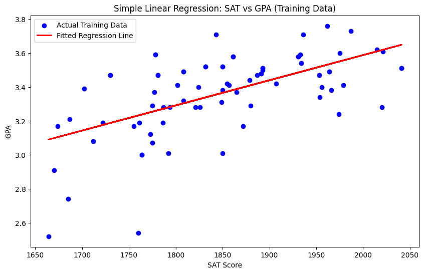
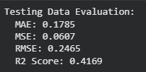

# 🎓 Student Score Prediction

A machine learning project that predicts student scores using **Simple Linear Regression**. This project demonstrates the complete machine learning workflow, including data preprocessing, exploratory data analysis (EDA), model training, prediction, evaluation, and visualization using Python and Scikit-learn.

---

## 📖 Project Overview

This project uses a student score dataset to build a Simple Linear Regression model that predicts a student's score based on study hours. It serves as a beginner-friendly introduction to supervised machine learning and regression analysis.

---

## ✨ Features

- Load and preprocess the dataset
- Perform Exploratory Data Analysis (EDA)
- Visualize the relationship between variables
- Train a Simple Linear Regression model
- Predict student scores
- Evaluate model performance
- Plot the regression line

---

## 🛠️ Technologies Used

- Python
- Google Colab
- Pandas
- NumPy
- Matplotlib
- Scikit-learn

---

## 📂 Project Structure

```
Student-Score-Prediction/
│
├── README.md
├── Simple_Linear_Regression.ipynb
├── Simple linear regression.csv
├── requirements.txt
└── images/
    ├── dataset_preview.png
    ├── regression_line.png
    └── model_evaluation.png
```

---

## 🚀 How to Run

1. Clone this repository.

```bash
git clone https://github.com/your-username/Student-Score-Prediction.git
```

2. Install the required libraries.

```bash
pip install -r requirements.txt
```

3. Open the notebook in Google Colab or Jupyter Notebook.

4. Run all cells.

---

## 📸 Project Screenshots

### Dataset Preview



---

### Regression Line



---

### Model Evaluation



---

## 📈 Results

The model successfully predicts student scores using Simple Linear Regression and is evaluated using:

- Mean Absolute Error (MAE)
- Mean Squared Error (MSE)
- Root Mean Squared Error (RMSE)
- R² Score

---

## 🔮 Future Improvements

- Train with larger datasets
- Implement Multiple Linear Regression
- Perform feature engineering
- Deploy the model using Streamlit

---

## 👨‍💻 Author

**Karthik**


## 🚀 How to Run

### 1. Clone the repository

```bash
git clone https://github.com/karthikvankadaru0712-max/Student-Score-Prediction.git
```

### 2. Navigate to the project folder

```bash
cd Student-Score-Prediction
```

### 3. Install the required libraries

```bash
pip install -r requirements.txt
```

### 4. Open the notebook

Open `Simple_Linear_Regression.ipynb` in **Google Colab** or **Jupyter Notebook**.

### 5. Run all cells

Execute all cells to train the model, generate predictions, and view the evaluation metrics and visualizations.
